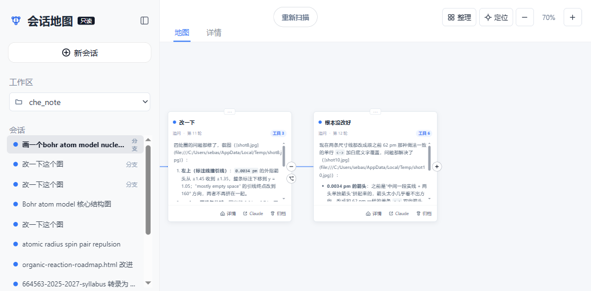

<h1 align="center">cc-synapse</h1>

<p align="center">Claude Code 的会话地图</p>

<p align="center">
  <a href="https://www.npmjs.com/package/cc-synapse"></a>
  <a href="https://github.com/lkh081231/cc-synapse/actions/workflows/main-tests.yml"></a>
  <a href="LICENSE"></a>
  <a href="package.json"></a>
</p>

<p align="center">
  <a href="docs/zh-CN/README.md">中文指南</a> ·
  <a href="docs/en/README.md">English guide</a> ·
  <a href="docs/architecture.md">架构</a> ·
  <a href="docs/development.md">开发与发布</a>
</p>

把 Claude Code 的历史会话摊开成一张可拖拽、可缩放的地图：每一次提问是一个节点，续写出来的会话接在它分叉的那一问旁边。

**它只读取 `~/.claude`，从不写回任何会话文件。**



## 快速开始

需要 Node.js `>= 22.19.0`。在任意项目目录下运行：

```powershell
npx cc-synapse
```

浏览器会自动打开当前目录的会话地图。想一次看到所有项目：

```powershell
npx cc-synapse --all
```

## 它做什么

- **一次提问就是一个节点。** 一轮对话里 Claude 可能回复十几段、调用几十次工具，这些全部收进同一张卡片；`AskUserQuestion` 的回答自成一个节点，因为那也是一次真实的用户输入。
- **还原分支关系。** Claude Code 续写会话时会另存一个新文件，两者之间没有任何指针，所以 cc-synapse 靠共享的提问前缀把它们接起来，连线落在真正分叉的那一问上。
- **跟着终端更新。** 你在终端里发一条消息，地图一两秒内就会出现新卡片。
- **回到终端继续。** 卡片上的「Claude」按钮会开一个新终端窗口，`--resume` 到那个会话。

## 常用选项

| 选项 | 说明 |
| --- | --- |
| `--all` | 显示所有项目，而不只是当前目录 |
| `--cwd <path>` | 查看指定项目 |
| `--port <n>` | 固定端口（默认自动选择） |
| `--no-open` | 不自动打开浏览器 |
| `--no-spawn` | 禁用「在 Claude 中打开」 |
| `--claude-dir <p>` | Claude Code 的数据目录（默认 `~/.claude`） |

完整选项见 `npx cc-synapse --help`。

## 边界

- **只读。** 画布只解析 `~/.claude/projects/**/*.jsonl`，唯一写入的是画布布局本身（默认在 `~/.cc-synapse/workspaces.json`）。归档一个会话只是把它从地图上隐藏，磁盘上的会话文件原样保留。
- **只监听回环地址。** 服务绑定 `127.0.0.1`，校验 `Host`，并要求写操作同源——否则别的网页可以借你的浏览器启动进程。
- **分支关系是推断出来的。** 会话文件里没有 fork 记录，共享前缀是唯一线索，偶尔会猜错。连线可以手动调整。
- **子代理不单独成图。** `Task` 派生的子会话存在单独的文件里，目前只以工具调用的形式出现在所属卡片中。

## 许可

[MIT](LICENSE)
